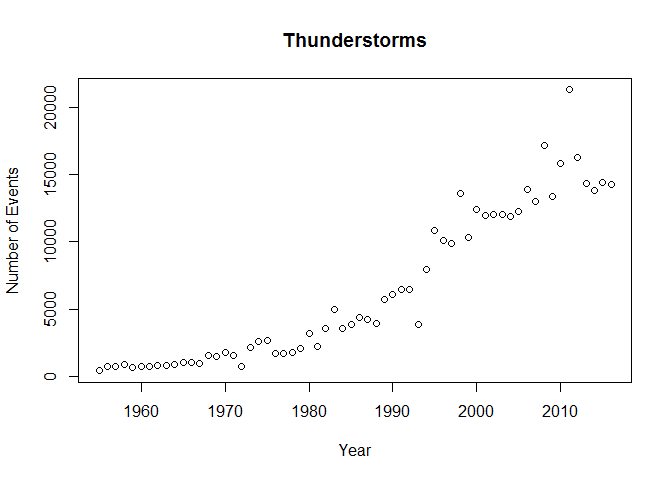
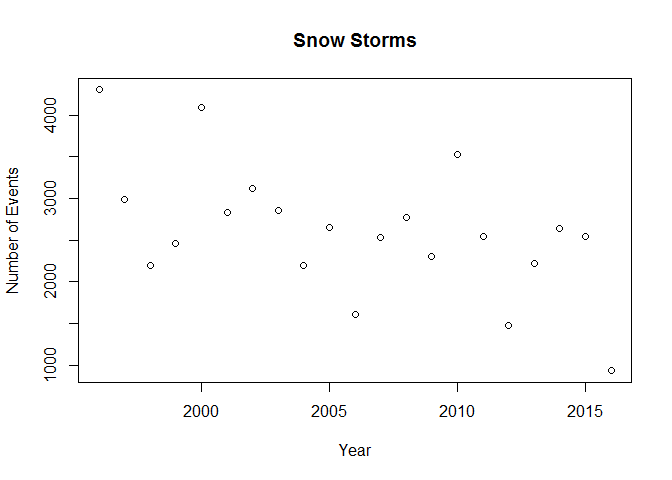

# Data-Exploration
J. Welch  
October 17, 2016  

# NCDC Storm Events Database Analysis

## Get Data from DATA.gov

I am an MBA student at Bridgewater State University, enrolled in MGMT582 - Business Intelligence/Analytics.  This data exploration project is intended to be my final project and in-class presentation.  The goal of this project is to gain practical working experience with R Studio and to apply some data analysis techniques in which we have been introduced within this course.

I have chosen to work with the NCDC Storm Events Database available at DATA.gov.  For more details related to this raw data set, see <https://catalog.data.gov/dataset/ncdc-storm-events-database>.

My first step in preparing my analysis will be to write a script to get the data at Data.gov.  After following instructions about the storm events database, I found that the raw data sits in zipped files located on an FTP server at <ftp://ftp.ncdc.noaa.gov/pub/data/swdi/stormevents/csvfiles/>.  I have prepared a script that will automatically get this data from its FTP location, unzip each file, and then append it to create a larger file that can be analyzed here with R Studio.  The development of this script was an iterative process, as I needed to be cautious of memory requirements.  

With my first pass at the collection of data from Data.gov, I collected 10 years of data back to 2006.  I found that my personal computer could handle this task and the stormdata.csv file was approximately 200MB in size.  Since my computer has nearly 8GB of RAM, I decided to go ahead and collect a full 65 years of storm data.  After pulling 65 years of data, I observed that my final stormdata.csv file was only 400MB in size.  This appears to be a very manageable data set that can be conveniently explored here with R Studio.

Now, the process of collecting this data via FTP, downloading, unzipping, and then concatenating each of the individual files is quite timely and it is not necessary to do all of this work with each and every execution of the Knitr markdown script.  To aid in the data exploration process, I will introduce caching into R Studio with the script as follows:


```r
knitr::opts_chunk$set(cache=TRUE)
```

Let's now iterate through 65 years of storm data, collect this data via download from the public FTP site, concatenate the data into a larger data set, and store a copy of this file locally on our computer.


```r
if (!file.exists("./stormdata.csv")) {
    # Load the R.utils library
    library("R.utils")
    
    i <- 1

    for (year in 1951:2016) {
        # Determine file name extension
        if (year==2006 || year==2014 || year==2015 || year==2016) {
            extstr <- "_c20161118.csv.gz"
        } else {
            extstr <- "_c20160223.csv.gz"
        }
        
        # Identify the URL of the download file
        URL <- paste("ftp://ftp.ncdc.noaa.gov/pub/data/swdi/stormevents/csvfiles/StormEvents_details-ftp_v1.0_d", year, extstr, sep="")
        #print(URL)

        # Download the file into the current directory
        download.file(URL, destfile = "./temp.csv.gz")

        # Unzip the file
        gunzip("./temp.csv.gz")

        # Read the file into memory
        tempdata <- read.csv("./temp.csv")
        
        # Delete the lengthy narrative columns
        # Filesize with these columns is 272MB
        # Filesize without these columns 79MB
        tempdata$EPISODE_NARRATIVE <- NULL
        tempdata$EVENT_NARRATIVE <- NULL
    
        if (i==1) {
            stormdata <- tempdata
        } else {
            stormdata <- rbind(stormdata, tempdata)
        }

        # Delete the temporary file
        unlink("./temp.csv")
        
        # Write the loaded data to local CSV file
        write.csv(stormdata, "./stormdata.csv")
        
        # Increment i
        i <- i+1
    }
    
} else if (!exists("stormdata")) {
    stormdata <- read.csv("./stormdata.csv")
}
```
## Initial Table Exploration and Observation

The script above has successfully assembled 65 years of data from the NCDC Storm Events Database from calendar year 1951 through summer of 2016.  We have eliminated the long text fields related to the description of the storm events.  We did this in order to produce a table size which is manageable on our desktop computers.  Elimination of these text fields dropped the file size to nearly 25% of its original size.  Our final CSV file is appx 400MB in size and it contains 1,401,817 observations of 50 variables.

It is now desirable to conduct some exploration techniques as outlined on RDatamining.com.  We will follow the examples put forth on the following page in order to begin our exploration of this significant data file.

<http://www.rdatamining.com/examples/exploration>


```r
# View the data frame inside the Global Environment of R Studio
#View(stormdata)

# Check the dimensionality
dim(stormdata)
```

```
## [1] 1401817      50
```

```r
# Output the names of the columns
names(stormdata)
```

```
##  [1] "X"                  "BEGIN_YEARMONTH"    "BEGIN_DAY"         
##  [4] "BEGIN_TIME"         "END_YEARMONTH"      "END_DAY"           
##  [7] "END_TIME"           "EPISODE_ID"         "EVENT_ID"          
## [10] "STATE"              "STATE_FIPS"         "YEAR"              
## [13] "MONTH_NAME"         "EVENT_TYPE"         "CZ_TYPE"           
## [16] "CZ_FIPS"            "CZ_NAME"            "WFO"               
## [19] "BEGIN_DATE_TIME"    "CZ_TIMEZONE"        "END_DATE_TIME"     
## [22] "INJURIES_DIRECT"    "INJURIES_INDIRECT"  "DEATHS_DIRECT"     
## [25] "DEATHS_INDIRECT"    "DAMAGE_PROPERTY"    "DAMAGE_CROPS"      
## [28] "SOURCE"             "MAGNITUDE"          "MAGNITUDE_TYPE"    
## [31] "FLOOD_CAUSE"        "CATEGORY"           "TOR_F_SCALE"       
## [34] "TOR_LENGTH"         "TOR_WIDTH"          "TOR_OTHER_WFO"     
## [37] "TOR_OTHER_CZ_STATE" "TOR_OTHER_CZ_FIPS"  "TOR_OTHER_CZ_NAME" 
## [40] "BEGIN_RANGE"        "BEGIN_AZIMUTH"      "BEGIN_LOCATION"    
## [43] "END_RANGE"          "END_AZIMUTH"        "END_LOCATION"      
## [46] "BEGIN_LAT"          "BEGIN_LON"          "END_LAT"           
## [49] "END_LON"            "DATA_SOURCE"
```

```r
# List the structure of the file
str(stormdata)
```

```
## 'data.frame':	1401817 obs. of  50 variables:
##  $ X                 : int  1 2 3 4 5 6 7 8 9 10 ...
##  $ BEGIN_YEARMONTH   : int  195109 195106 195103 195105 195107 195105 195103 195105 195106 195107 ...
##  $ BEGIN_DAY         : int  9 17 28 9 15 8 30 11 27 21 ...
##  $ BEGIN_TIME        : int  915 2200 510 1830 1620 1800 1500 1330 2204 1100 ...
##  $ END_YEARMONTH     : int  195109 195106 195103 195105 195107 195105 195103 195105 195106 195107 ...
##  $ END_DAY           : int  9 17 28 9 15 8 30 11 27 21 ...
##  $ END_TIME          : int  915 2200 510 1830 1620 1800 1500 1330 2204 1100 ...
##  $ EPISODE_ID        : int  NA NA NA NA NA NA NA NA NA NA ...
##  $ EVENT_ID          : int  10047282 10028729 10120421 10099717 10099742 10028691 10104933 10104934 10104935 10104936 ...
##  $ STATE             : Factor w/ 69 levels "","ALABAMA","ALASKA",..: 40 26 61 52 52 26 54 54 54 54 ...
##  $ STATE_FIPS        : int  28 20 48 40 40 20 42 42 42 42 ...
##  $ YEAR              : int  1951 1951 1951 1951 1951 1951 1951 1951 1951 1951 ...
##  $ MONTH_NAME        : Factor w/ 12 levels "April","August",..: 12 7 8 9 6 9 8 9 7 6 ...
##  $ EVENT_TYPE        : Factor w/ 74 levels "Astronomical Low Tide",..: 63 63 63 63 63 63 63 63 63 63 ...
##  $ CZ_TYPE           : Factor w/ 3 levels "C","M","Z": 1 1 1 1 1 1 1 1 1 1 ...
##  $ CZ_FIPS           : int  87 63 225 33 73 203 1 111 5 15 ...
##  $ CZ_NAME           : Factor w/ 5135 levels "","5NM E OF FAIRPORT MI TO ROCK ISLAND PASSAGE",..: 2507 1673 1939 1011 2195 4978 17 4003 116 356 ...
##  $ WFO               : Factor w/ 542 levels "","$AC","$AG",..: NA NA NA NA NA NA NA NA NA NA ...
##  $ BEGIN_DATE_TIME   : Factor w/ 754787 levels "01-APR-00 00:00:00",..: 223320 409904 687802 219403 357636 193110 733184 271822 660342 505338 ...
##  $ CZ_TIMEZONE       : Factor w/ 26 levels "AKST-9","AST",..: 7 7 7 7 7 7 7 7 7 7 ...
##  $ END_DATE_TIME     : Factor w/ 746369 levels "01-APR-00 00:05:00",..: 219760 404183 679406 215886 352362 190068 724347 267679 652124 498484 ...
##  $ INJURIES_DIRECT   : int  0 0 0 0 0 0 0 1 0 0 ...
##  $ INJURIES_INDIRECT : int  0 0 0 0 0 0 0 0 0 0 ...
##  $ DEATHS_DIRECT     : int  0 0 0 0 0 0 0 0 0 0 ...
##  $ DEATHS_INDIRECT   : int  0 0 0 0 0 0 0 0 0 0 ...
##  $ DAMAGE_PROPERTY   : Factor w/ 2618 levels "",".01K",".01M",..: 206 206 924 924 47 47 924 1168 924 47 ...
##  $ DAMAGE_CROPS      : Factor w/ 1108 levels "",".01K",".01M",..: 59 59 59 59 59 59 59 59 59 59 ...
##  $ SOURCE            : Factor w/ 73 levels "","911 Call Center",..: NA NA NA NA NA NA NA NA NA NA ...
##  $ MAGNITUDE         : num  0 0 0 0 0 0 0 0 0 0 ...
##  $ MAGNITUDE_TYPE    : Factor w/ 7 levels "","E","EG","ES",..: NA NA NA NA NA NA NA NA NA NA ...
##  $ FLOOD_CAUSE       : Factor w/ 8 levels "","Dam / Levee Break",..: NA NA NA NA NA NA NA NA NA NA ...
##  $ CATEGORY          : int  NA NA NA NA NA NA NA NA NA NA ...
##  $ TOR_F_SCALE       : Factor w/ 14 levels "","EF0","EF1",..: 11 9 10 10 11 10 10 11 11 9 ...
##  $ TOR_LENGTH        : num  0.1 0.7 0.5 0 0 0 0.1 8 19.7 0.1 ...
##  $ TOR_WIDTH         : num  100 33 17 33 100 33 20 33 33 33 ...
##  $ TOR_OTHER_WFO     : Factor w/ 90 levels "","ABQ","ABR",..: NA NA NA NA NA NA NA NA NA NA ...
##  $ TOR_OTHER_CZ_STATE: Factor w/ 40 levels "","AL","AR","CA",..: NA NA NA NA NA NA NA NA NA NA ...
##  $ TOR_OTHER_CZ_FIPS : int  NA NA NA NA NA NA NA NA NA NA ...
##  $ TOR_OTHER_CZ_NAME : Factor w/ 697 levels "","ADAIR","ADAMS",..: NA NA NA NA NA NA NA NA NA NA ...
##  $ BEGIN_RANGE       : int  0 0 0 0 0 0 0 0 0 0 ...
##  $ BEGIN_AZIMUTH     : Factor w/ 31 levels "","E","Eas","EE",..: NA NA NA NA NA NA NA NA NA NA ...
##  $ BEGIN_LOCATION    : Factor w/ 58057 levels "","- 1 N Albion",..: NA NA NA NA NA NA NA NA NA NA ...
##  $ END_RANGE         : int  0 0 0 0 0 0 0 0 0 0 ...
##  $ END_AZIMUTH       : Factor w/ 24 levels "","E","ENE","ENESE",..: NA NA NA NA NA NA NA NA NA NA ...
##  $ END_LOCATION      : Factor w/ 47039 levels "","- .5 NNW",..: NA NA NA NA NA NA NA NA NA NA ...
##  $ BEGIN_LAT         : num  33.5 39.1 31.4 34.5 34.8 ...
##  $ BEGIN_LON         : num  -88.4 -100.2 -95.6 -98.3 -94.8 ...
##  $ END_LAT           : num  NA NA NA NA NA ...
##  $ END_LON           : num  NA NA NA NA NA ...
##  $ DATA_SOURCE       : Factor w/ 4 levels "CSV","PDC","PDS",..: 4 4 4 4 4 4 4 4 4 4 ...
```

```r
# Output the first 5 rows of the file
head(stormdata, n=5)
```

```
##   X BEGIN_YEARMONTH BEGIN_DAY BEGIN_TIME END_YEARMONTH END_DAY END_TIME
## 1 1          195109         9        915        195109       9      915
## 2 2          195106        17       2200        195106      17     2200
## 3 3          195103        28        510        195103      28      510
## 4 4          195105         9       1830        195105       9     1830
## 5 5          195107        15       1620        195107      15     1620
##   EPISODE_ID EVENT_ID       STATE STATE_FIPS YEAR MONTH_NAME EVENT_TYPE
## 1         NA 10047282 MISSISSIPPI         28 1951  September    Tornado
## 2         NA 10028729      KANSAS         20 1951       June    Tornado
## 3         NA 10120421       TEXAS         48 1951      March    Tornado
## 4         NA 10099717    OKLAHOMA         40 1951        May    Tornado
## 5         NA 10099742    OKLAHOMA         40 1951       July    Tornado
##   CZ_TYPE CZ_FIPS    CZ_NAME  WFO    BEGIN_DATE_TIME CZ_TIMEZONE
## 1       C      87    LOWNDES <NA> 09-SEP-51 09:15:00         CST
## 2       C      63       GOVE <NA> 17-JUN-51 22:00:00         CST
## 3       C     225    HOUSTON <NA> 28-MAR-51 05:10:00         CST
## 4       C      33     COTTON <NA> 09-MAY-51 18:30:00         CST
## 5       C      73 KINGFISHER <NA> 15-JUL-51 16:20:00         CST
##        END_DATE_TIME INJURIES_DIRECT INJURIES_INDIRECT DEATHS_DIRECT
## 1 09-SEP-51 09:15:00               0                 0             0
## 2 17-JUN-51 22:00:00               0                 0             0
## 3 28-MAR-51 05:10:00               0                 0             0
## 4 09-MAY-51 18:30:00               0                 0             0
## 5 15-JUL-51 16:20:00               0                 0             0
##   DEATHS_INDIRECT DAMAGE_PROPERTY DAMAGE_CROPS SOURCE MAGNITUDE
## 1               0              0K            0   <NA>         0
## 2               0              0K            0   <NA>         0
## 3               0            2.5K            0   <NA>         0
## 4               0            2.5K            0   <NA>         0
## 5               0            .25K            0   <NA>         0
##   MAGNITUDE_TYPE FLOOD_CAUSE CATEGORY TOR_F_SCALE TOR_LENGTH TOR_WIDTH
## 1           <NA>        <NA>       NA          F2        0.1       100
## 2           <NA>        <NA>       NA          F0        0.7        33
## 3           <NA>        <NA>       NA          F1        0.5        17
## 4           <NA>        <NA>       NA          F1        0.0        33
## 5           <NA>        <NA>       NA          F2        0.0       100
##   TOR_OTHER_WFO TOR_OTHER_CZ_STATE TOR_OTHER_CZ_FIPS TOR_OTHER_CZ_NAME
## 1          <NA>               <NA>                NA              <NA>
## 2          <NA>               <NA>                NA              <NA>
## 3          <NA>               <NA>                NA              <NA>
## 4          <NA>               <NA>                NA              <NA>
## 5          <NA>               <NA>                NA              <NA>
##   BEGIN_RANGE BEGIN_AZIMUTH BEGIN_LOCATION END_RANGE END_AZIMUTH
## 1           0          <NA>           <NA>         0        <NA>
## 2           0          <NA>           <NA>         0        <NA>
## 3           0          <NA>           <NA>         0        <NA>
## 4           0          <NA>           <NA>         0        <NA>
## 5           0          <NA>           <NA>         0        <NA>
##   END_LOCATION BEGIN_LAT BEGIN_LON END_LAT END_LON DATA_SOURCE
## 1         <NA>     33.50    -88.43      NA      NA         PUB
## 2         <NA>     39.07   -100.23      NA      NA         PUB
## 3         <NA>     31.37    -95.60      NA      NA         PUB
## 4         <NA>     34.45    -98.32      NA      NA         PUB
## 5         <NA>     34.80    -94.80      NA      NA         PUB
```

```r
# Distribution of every variable
summary(stormdata)
```

```
##        X           BEGIN_YEARMONTH    BEGIN_DAY       BEGIN_TIME  
##  Min.   :      1   Min.   :195101   Min.   : 1.00   Min.   :   0  
##  1st Qu.: 350455   1st Qu.:199806   1st Qu.: 7.00   1st Qu.: 900  
##  Median : 700909   Median :200506   Median :15.00   Median :1520  
##  Mean   : 700909   Mean   :200258   Mean   :15.01   Mean   :1331  
##  3rd Qu.:1051363   3rd Qu.:201103   3rd Qu.:23.00   3rd Qu.:1824  
##  Max.   :1401817   Max.   :201608   Max.   :31.00   Max.   :2359  
##                                                                   
##  END_YEARMONTH       END_DAY         END_TIME      EPISODE_ID     
##  Min.   :195101   Min.   : 1.00   Min.   :   0   Min.   :      1  
##  1st Qu.:199806   1st Qu.: 8.00   1st Qu.:1200   1st Qu.:  51531  
##  Median :200506   Median :16.00   Median :1615   Median : 103331  
##  Mean   :200258   Mean   :16.34   Mean   :1490   Mean   : 709598  
##  3rd Qu.:201103   3rd Qu.:24.00   3rd Qu.:1910   3rd Qu.:1177854  
##  Max.   :201608   Max.   :31.00   Max.   :2359   Max.   :2414827  
##                                                  NA's   :232016   
##     EVENT_ID             STATE           STATE_FIPS         YEAR     
##  Min.   :       3   TEXAS   : 117456   Min.   : 1.00   Min.   :1951  
##  1st Qu.:  370393   KANSAS  :  71157   1st Qu.:19.00   1st Qu.:1998  
##  Median : 5254290   OKLAHOMA:  60550   Median :30.00   Median :2005  
##  Mean   : 3948304   MISSOURI:  52747   Mean   :31.56   Mean   :2003  
##  3rd Qu.: 5605881   IOWA    :  50453   3rd Qu.:45.00   3rd Qu.:2011  
##  Max.   :10358522   NEBRASKA:  45590   Max.   :99.00   Max.   :2016  
##                     (Other) :1003864   NA's   :1                     
##    MONTH_NAME                 EVENT_TYPE     CZ_TYPE       CZ_FIPS      
##  June   :220903   Thunderstorm Wind:397658   C:947024   Min.   :  0.00  
##  July   :188175   Hail             :339848   M:  7513   1st Qu.: 25.00  
##  May    :186714   Flash Flood      : 72281   Z:447280   Median : 65.00  
##  April  :140301   Tornado          : 65851              Mean   : 92.84  
##  August :128854   Winter Storm     : 64208              3rd Qu.:117.00  
##  March  : 99832   High Wind        : 58732              Max.   :876.00  
##  (Other):437038   (Other)          :403239                              
##        CZ_NAME             WFO                    BEGIN_DATE_TIME   
##  WASHINGTON:  11902   PHI    :  33131   01-JUL-12 00:00:00:   1163  
##  JEFFERSON :  11877   LWX    :  30961   01-AUG-12 00:00:00:   1129  
##  JACKSON   :  10324   PAH    :  28519   01-SEP-12 00:00:00:    998  
##  FRANKLIN  :   9666   OUN    :  27764   01-OCT-12 00:00:00:    883  
##  MADISON   :   8979   DMX    :  22484   01-NOV-12 00:00:00:    809  
##  MONTGOMERY:   8937   (Other):1150768   01-DEC-12 00:00:00:    789  
##  (Other)   :1340132   NA's   : 108190   (Other)           :1396046  
##   CZ_TIMEZONE                END_DATE_TIME     INJURIES_DIRECT    
##  CST    :472216   31-JUL-12 23:59:00:   1107   Min.   :   0.0000  
##  CST-6  :300416   31-AUG-12 23:59:00:   1009   1st Qu.:   0.0000  
##  EST-5  :221013   30-JUN-12 23:59:00:    929   Median :   0.0000  
##  EST    :215488   30-SEP-12 23:59:00:    889   Mean   :   0.1054  
##  MST-7  : 68724   30-NOV-12 23:59:00:    778   3rd Qu.:   0.0000  
##  MST    : 54611   31-DEC-12 23:59:00:    772   Max.   :1700.0000  
##  (Other): 69349   (Other)           :1396333                      
##  INJURIES_INDIRECT DEATHS_DIRECT       DEATHS_INDIRECT    
##  Min.   :0.0e+00   Min.   :  0.00000   Min.   : 0.000000  
##  1st Qu.:0.0e+00   1st Qu.:  0.00000   1st Qu.: 0.000000  
##  Median :0.0e+00   Median :  0.00000   Median : 0.000000  
##  Mean   :8.3e-03   Mean   :  0.01126   Mean   : 0.001357  
##  3rd Qu.:0.0e+00   3rd Qu.:  0.00000   3rd Qu.: 0.000000  
##  Max.   :2.4e+03   Max.   :158.00000   Max.   :13.000000  
##                                                           
##  DAMAGE_PROPERTY   DAMAGE_CROPS                SOURCE      
##         :482876          :595165   Trained Spotter:120833  
##  0.00K  :374040   0.00K  :510225                  :113626  
##  0      :200035   0      :256102   TRAINED SPOTTER: 87990  
##  5K     : 23324   0K     :  8947   LAW ENFORCEMENT: 85397  
##  5.00K  : 20060   5K     :  3084   Public         : 67657  
##  1.00K  : 19205   10K    :  1555   (Other)        :694298  
##  (Other):282277   (Other): 26739   NA's           :232016  
##    MAGNITUDE       MAGNITUDE_TYPE                         FLOOD_CAUSE    
##  Min.   :    0.0          :862684                               :611299  
##  1st Qu.:    0.8   EG     :206909   Heavy Rain                  : 53881  
##  Median :    1.8   MG     : 59652   Heavy Rain / Snow Melt      :  2968  
##  Mean   :   24.3   E      : 23246   Heavy Rain / Tropical System:  1467  
##  3rd Qu.:   52.0   M      :  8302   Heavy Rain / Burn Area      :   455  
##  Max.   :22000.0   (Other):  9008   (Other)                     :   664  
##  NA's   :568658    NA's   :232016   NA's                        :731083  
##     CATEGORY        TOR_F_SCALE        TOR_LENGTH        TOR_WIDTH      
##  Min.   :1.0              :1337925   Min.   :   0.0    Min.   :   0.0   
##  1st Qu.:1.0       F0     :  20760   1st Qu.:   0.0    1st Qu.:   0.0   
##  Median :1.0       F1     :  16839   Median :   0.0    Median :   0.0   
##  Mean   :1.2       F2     :   8944   Mean   :   0.8    Mean   :  29.3   
##  3rd Qu.:1.0       EF0    :   7183   3rd Qu.:   0.0    3rd Qu.:   5.0   
##  Max.   :5.0       EF1    :   4318   Max.   :2315.0    Max.   :4576.0   
##  NA's   :1401627   (Other):   5848   NA's   :1141285   NA's   :1141285  
##  TOR_OTHER_WFO    TOR_OTHER_CZ_STATE TOR_OTHER_CZ_FIPS  TOR_OTHER_CZ_NAME 
##         :669024          :669024     Min.   :  1.0               :669024  
##  JAN    :   111   AL     :   176     1st Qu.: 49.0     JEFFERSON :    20  
##  BMX    :   105   MS     :   141     Median : 93.0     MADISON   :    17  
##  FFC    :    97   AR     :   127     Mean   :102.6     NEWTON    :    17  
##  LZK    :    90   OK     :   126     3rd Qu.:139.0     WASHINGTON:    17  
##  (Other):  1307   (Other):  1140     Max.   :740.0     (Other)   :  1639  
##  NA's   :731083   NA's   :731083     NA's   :1400107   NA's      :731083  
##   BEGIN_RANGE     BEGIN_AZIMUTH        BEGIN_LOCATION     END_RANGE     
##  Min.   :   0.0          :683773              :432868   Min.   :  0.0   
##  1st Qu.:   0.0   N      :127649   COUNTYWIDE : 19665   1st Qu.:  0.0   
##  Median :   1.0   W      : 52590   SPRINGFIELD:  1012   Median :  1.0   
##  Mean   :   2.4   S      : 50417   AMARILLO   :   936   Mean   :  2.3   
##  3rd Qu.:   3.0   E      : 47374   COLUMBIA   :   931   3rd Qu.:  3.0   
##  Max.   :3749.0   (Other):252750   (Other)    :759141   Max.   :925.0   
##  NA's   :652540   NA's   :187264   NA's       :187264   NA's   :652917  
##   END_AZIMUTH          END_LOCATION      BEGIN_LAT        BEGIN_LON     
##         :696854              :472223   Min.   :-14.4    Min.   :-815.1  
##  N      :118352   COUNTYWIDE : 19717   1st Qu.: 34.4    1st Qu.: -97.6  
##  S      : 48723   SPRINGFIELD:   985   Median : 38.0    Median : -91.7  
##  W      : 48037   AMARILLO   :   941   Mean   : 37.9    Mean   : -92.8  
##  E      : 47987   COLUMBIA   :   904   3rd Qu.: 41.4    3rd Qu.: -83.8  
##  (Other):254600   (Other)    :719783   Max.   : 70.5    Max.   : 171.4  
##  NA's   :187264   NA's       :187264   NA's   :535978   NA's   :535978  
##     END_LAT          END_LON       DATA_SOURCE 
##  Min.   :-14.5    Min.   :-815.1   CSV:666924  
##  1st Qu.: 34.6    1st Qu.: -97.5   PDC:239915  
##  Median : 38.0    Median : -91.2   PDS:307714  
##  Mean   : 37.9    Mean   : -93.0   PUB:187264  
##  3rd Qu.: 41.4    3rd Qu.: -83.4               
##  Max.   : 70.4    Max.   : 171.4               
##  NA's   :713360   NA's   :713359
```

## Introduction to the Table() Function

According to R-Bloggers.com <https://www.r-bloggers.com/r-function-of-the-day-table/>, "the table() function is a very basic, but essential, function to master while performing interactive data analyses.  It simply creates tabular results of categorical variables.  However, when combined with the powers of logical expressions in R, you can gain even more insights into your data, including identifying potential problems.


```r
# Frequency of event types - sorted by decreasing count and selected for top 10 events.
counts <- sort(table(stormdata$EVENT_TYPE), decreasing=TRUE)[1:10]

# Output the first 5 rows of the file
head(counts, n=25)
```

```
## 
## Thunderstorm Wind              Hail       Flash Flood           Tornado 
##            397658            339848             72281             65851 
##      Winter Storm         High Wind        Heavy Snow           Drought 
##             64208             58732             54813             49115 
##    Winter Weather             Flood 
##             48635             42981
```

```r
# Get the names of columns on counts table
names(counts)
```

```
##  [1] "Thunderstorm Wind" "Hail"              "Flash Flood"      
##  [4] "Tornado"           "Winter Storm"      "High Wind"        
##  [7] "Heavy Snow"        "Drought"           "Winter Weather"   
## [10] "Flood"
```

```r
# Pie Chart
pie(counts)
```

 

```r
# Simple Horizontal Bar Plot
barplot(counts, main="Storm Event Type", horiz=TRUE, xlab="Frequency", names.arg=names(counts), cex.names=0.5, las=1)
```

 

## Trend Analysis

It is now desirable to complete a trend analysis whereby we can visualize the frequency of events by year so that we can see if there is an upward trend in the number of occurrences of these major weather events.

I want to complete a sub-setting technique using R, such that I complete the equivalent of an SQL query like the following:

SELECT YEAR, COUNT(*) 
  FROM stormdata
  WHERE EVENT_TYPE='Thunderstorm Wind'
  GROUP BY YEAR
  ORDER BY YEAR
  
### Thunderstorm Events


```r
# Subset the stormdata data frame
thunderstorms <- stormdata[stormdata$EVENT_TYPE=="Thunderstorm Wind",c('YEAR', 'EVENT_TYPE', 'INJURIES_DIRECT', 'INJURIES_INDIRECT', 'DEATHS_DIRECT', 'DEATHS_INDIRECT', 'DAMAGE_PROPERTY', 'DAMAGE_CROPS', 'MAGNITUDE', 'MAGNITUDE_TYPE')] %>% group_by(YEAR) %>% summarise(number = n())

# Create Simple Plot
plot(thunderstorms$YEAR, thunderstorms$number, type="p", main="Thunderstorms", xlab="Year", ylab="Number of Events")
```

 

### Hail Storm Events


```r
# Subset the stormdata data frame
hailstorms <- stormdata[stormdata$EVENT_TYPE=="Hail",c('YEAR', 'EVENT_TYPE', 'INJURIES_DIRECT', 'INJURIES_INDIRECT', 'DEATHS_DIRECT', 'DEATHS_INDIRECT', 'DAMAGE_PROPERTY', 'DAMAGE_CROPS', 'MAGNITUDE', 'MAGNITUDE_TYPE')] %>% group_by(YEAR) %>% summarise(number = n())

# Create Simple Plot
plot(hailstorms$YEAR, hailstorms$number, type="p", main="Hail Storms", xlab="Year", ylab="Number of Events")
```

 

### Tornado Events


```r
# Subset the stormdata data frame
tornados <- stormdata[stormdata$EVENT_TYPE=="Tornado",c('YEAR', 'EVENT_TYPE', 'INJURIES_DIRECT', 'INJURIES_INDIRECT', 'DEATHS_DIRECT', 'DEATHS_INDIRECT', 'DAMAGE_PROPERTY', 'DAMAGE_CROPS', 'MAGNITUDE', 'MAGNITUDE_TYPE')] %>% group_by(YEAR) %>% summarise(number = n())

# Create Simple Plot
plot(tornados$YEAR, tornados$number, type="p", main="Tornados", xlab="Year", ylab="Number of Events")
```

 

### Winter Storm Events


```r
# Subset the stormdata data frame
winterstorms <- stormdata[stormdata$EVENT_TYPE=="Winter Storm",c('YEAR', 'EVENT_TYPE', 'INJURIES_DIRECT', 'INJURIES_INDIRECT', 'DEATHS_DIRECT', 'DEATHS_INDIRECT', 'DAMAGE_PROPERTY', 'DAMAGE_CROPS', 'MAGNITUDE', 'MAGNITUDE_TYPE')] %>% group_by(YEAR) %>% summarise(number = n())

# Create Simple Plot
plot(winterstorms$YEAR, winterstorms$number, type="p", main="Winter Storms", xlab="Year", ylab="Number of Events")
```

 

### Snow Storm Events


```r
# Subset the stormdata data frame
snowstorms <- stormdata[stormdata$EVENT_TYPE=="Heavy Snow",c('YEAR', 'EVENT_TYPE', 'INJURIES_DIRECT', 'INJURIES_INDIRECT', 'DEATHS_DIRECT', 'DEATHS_INDIRECT', 'DAMAGE_PROPERTY', 'DAMAGE_CROPS', 'MAGNITUDE', 'MAGNITUDE_TYPE')] %>% group_by(YEAR) %>% summarise(number = n())

# Create Simple Plot
plot(snowstorms$YEAR, snowstorms$number, type="p", main="Snow Storms", xlab="Year", ylab="Number of Events")
```

 

## Conclusions

This data analysis project has certainly exposed me to many tools and resources which are available in order to complete a data mining project using important historical data sets.  We have gathered a total of 65 years of weather data for this exercise from the United States government via Data.gov and we have explored the content of this data with the aid of R Studio.  We set out to see if we could create a visualization of this data that demonstrates claims that global warming could be contributing to an increased occurrence of weather events here within the United States.  The historical data certainly shows a significant increase in the occurrence of all weather events (with the only exception where there is limited historical data).  In fact, the records show that the increased frequency of storms is shockingly increasing at what appears to be logarithmic rates.  What we don't know from this data is whether or not the sharp upward trend is a reflection of our increased ability to monitor and to gather this data or if there is a real upward rate in actual occurrence of these weather events.

This exercise was not intended to break any ground by creating any new awareness of what has been studied many times before this one.  The main purpose of my personal study was to gather an increased awareness of how to gather and how to complete a data mining study with some rather interesting data.

