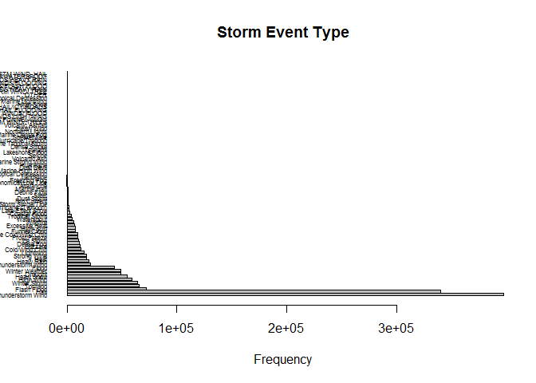

# Data-Exploration
J. Welch  
October 17, 2016  

# NCDC Storm Events Database Analysis

## Get and Clean Data from DATA.gov

I am an MBA student at Bridgewater State University, enrolled in MGMT582 - Business Intelligence/Analytics.  This data exploration project is intended to be my final project and in-class presentation.  The goal of this project is to gain practical working experience with R Studio and to apply some data analysis techniques in which we have been introduced within this course.

I have chosen to work with the NCDC Storm Events Database available at DATA.gov.  For more details related to this raw data set, see <https://catalog.data.gov/dataset/ncdc-storm-events-database>.

My first step in preparing my analysis will be to write a script to get the data at Data.gov.  After following instructions about the storm events database, I found that the raw data sits in zipped files located on an FTP server at <ftp://ftp.ncdc.noaa.gov/pub/data/swdi/stormevents/csvfiles/>.  I am going to attempt to write a script that will automatically get this data from its FTP location, unzip each file, and then append it to create a larger file that can be analyzed here with R Studio.


```r
if (!file.exists("./stormdata.csv")) {
    # Load the R.utils library
    library("R.utils")
    
    i <- 1

    for (year in 2006:2016) {
        # Determine file name extension
        if (year==2014) {
            extstr <- "_c20160617.csv.gz"
        } else if (year==2015 || year==2016) {
            extstr <- "_c20160921.csv.gz"
        } else {
            extstr <- "_c20160223.csv.gz"
        }
        
        # Identify the URL of the download file
        URL <- paste("ftp://ftp.ncdc.noaa.gov/pub/data/swdi/stormevents/csvfiles/StormEvents_details-ftp_v1.0_d", year, extstr, sep="")
        #print(URL)

        # Download the file into the current directory
        download.file(URL, destfile = "./temp.csv.gz")

        # Unzip the file
        gunzip("./temp.csv.gz")

        # Read the file into memory
        tempdata <- read.csv("./temp.csv")
        
        # Delete the lengthy narrative columns
        # Filesize with these columns is 272MB
        # Filesize without these columns 79MB
        tempdata$EPISODE_NARRATIVE <- NULL
        tempdata$EVENT_NARRATIVE <- NULL
    
        if (i==1) {
            stormdata <- tempdata
        } else {
            stormdata <- rbind(stormdata, tempdata)
        }

        # Delete the temporary file
        unlink("./temp.csv")
        
        # Write the loaded data to local CSV file
        write.csv(stormdata, "./stormdata.csv")
        
        # Increment i
        i <- i+1
    }
    
} else if (!exists("stormdata")) {
    stormdata <- read.csv("./stormdata.csv")
}
```
## Initial Table Exploration and Observation

The script above has successfully assembled 10+ years of data from the NCDC Storm Events Database from calendar year 2006 through summer of 2016.  We have eliminated the long text fields related to the description of the storm events.  We did this in order to produce a table size which is manageable on our desktop computers.  Elimination of these text fields dropped the file size to nearly 25% of its original size.  Our final CSV file is appx 193MB in size and it contains 656K observations of 50 variables.

It is now desirable to conduct some exploration techniques as outlined on RDatamining.com.  We will follow the examples put forth on the following page in order to begin our exploration of this significant data file.

<http://www.rdatamining.com/examples/exploration>


```r
# View the data frame inside the Global Environment of R Studio
#View(stormdata)

# Check the dimensionality
dim(stormdata)
```

```
## [1] 655983     50
```

```r
# Output the names of the columns
names(stormdata)
```

```
##  [1] "X"                  "BEGIN_YEARMONTH"    "BEGIN_DAY"         
##  [4] "BEGIN_TIME"         "END_YEARMONTH"      "END_DAY"           
##  [7] "END_TIME"           "EPISODE_ID"         "EVENT_ID"          
## [10] "STATE"              "STATE_FIPS"         "YEAR"              
## [13] "MONTH_NAME"         "EVENT_TYPE"         "CZ_TYPE"           
## [16] "CZ_FIPS"            "CZ_NAME"            "WFO"               
## [19] "BEGIN_DATE_TIME"    "CZ_TIMEZONE"        "END_DATE_TIME"     
## [22] "INJURIES_DIRECT"    "INJURIES_INDIRECT"  "DEATHS_DIRECT"     
## [25] "DEATHS_INDIRECT"    "DAMAGE_PROPERTY"    "DAMAGE_CROPS"      
## [28] "SOURCE"             "MAGNITUDE"          "MAGNITUDE_TYPE"    
## [31] "FLOOD_CAUSE"        "CATEGORY"           "TOR_F_SCALE"       
## [34] "TOR_LENGTH"         "TOR_WIDTH"          "TOR_OTHER_WFO"     
## [37] "TOR_OTHER_CZ_STATE" "TOR_OTHER_CZ_FIPS"  "TOR_OTHER_CZ_NAME" 
## [40] "BEGIN_RANGE"        "BEGIN_AZIMUTH"      "BEGIN_LOCATION"    
## [43] "END_RANGE"          "END_AZIMUTH"        "END_LOCATION"      
## [46] "BEGIN_LAT"          "BEGIN_LON"          "END_LAT"           
## [49] "END_LON"            "DATA_SOURCE"
```

```r
# List the structure of the file
str(stormdata)
```

```
## 'data.frame':	655983 obs. of  50 variables:
##  $ X                 : int  1 2 3 4 5 6 7 8 9 10 ...
##  $ BEGIN_YEARMONTH   : int  200604 200601 200601 200601 200601 200601 200601 200601 200601 200601 ...
##  $ BEGIN_DAY         : int  7 1 1 1 1 10 30 30 28 28 ...
##  $ BEGIN_TIME        : int  1515 0 0 0 0 1100 500 500 800 1400 ...
##  $ END_YEARMONTH     : int  200604 200601 200601 200601 200601 200601 200601 200601 200601 200601 ...
##  $ END_DAY           : int  7 31 31 31 31 10 31 31 29 29 ...
##  $ END_TIME          : int  1515 2359 2359 2359 2359 1100 1400 1400 1300 500 ...
##  $ EPISODE_ID        : int  1207534 1202408 1202408 1202408 1202408 1202432 1202394 1202394 1202395 1202396 ...
##  $ EVENT_ID          : int  5501658 5482463 5482464 5482465 5482466 5482724 5482324 5482325 5482326 5482327 ...
##  $ STATE             : Factor w/ 68 levels "ALABAMA","ALASKA",..: 23 9 9 9 9 25 9 9 9 9 ...
##  $ STATE_FIPS        : int  18 8 8 8 8 20 8 8 8 8 ...
##  $ YEAR              : int  2006 2006 2006 2006 2006 2006 2006 2006 2006 2006 ...
##  $ MONTH_NAME        : Factor w/ 12 levels "April","August",..: 1 5 5 5 5 5 5 5 5 5 ...
##  $ EVENT_TYPE        : Factor w/ 56 levels "Astronomical Low Tide",..: 46 9 9 9 9 22 56 56 55 56 ...
##  $ CZ_TYPE           : Factor w/ 3 levels "C","M","Z": 1 3 3 3 3 3 3 3 3 3 ...
##  $ CZ_FIPS           : int  51 2 7 4 13 92 4 13 13 5 ...
##  $ CZ_NAME           : Factor w/ 4311 levels "5NM E OF FAIRPORT MI TO ROCK ISLAND PASSAGE",..: 1392 577 977 1235 1312 3677 1235 1312 1312 3885 ...
##  $ WFO               : Factor w/ 125 levels "ABQ","ABR","AFC",..: 97 46 46 46 46 58 46 46 46 46 ...
##  $ BEGIN_DATE_TIME   : Factor w/ 332526 levels "01-APR-06 00:00:00",..: 63753 2931 2931 2931 2931 100656 318116 318116 298587 298596 ...
##  $ CZ_TIMEZONE       : Factor w/ 16 levels "AKST-9","AST",..: 4 11 11 11 11 4 11 11 11 11 ...
##  $ END_DATE_TIME     : Factor w/ 326849 levels "01-APR-06 00:50:00",..: 62437 321468 321468 321468 321468 98418 321457 321457 302862 302859 ...
##  $ INJURIES_DIRECT   : int  0 0 0 0 0 0 0 0 0 0 ...
##  $ INJURIES_INDIRECT : int  0 0 0 0 0 0 0 0 0 0 ...
##  $ DEATHS_DIRECT     : int  0 0 0 0 0 0 0 0 0 0 ...
##  $ DEATHS_INDIRECT   : int  0 0 0 0 0 0 0 0 0 0 ...
##  $ DAMAGE_PROPERTY   : Factor w/ 1639 levels "",".01K",".01M",..: 1313 1 1 1 1 30 1 1 1 1 ...
##  $ DAMAGE_CROPS      : Factor w/ 576 levels "",".1K",".2K",..: 1 1 1 1 1 6 1 1 1 1 ...
##  $ SOURCE            : Factor w/ 71 levels "911 Call Center",..: 28 29 29 29 29 65 8 8 8 65 ...
##  $ MAGNITUDE         : num  61 NA NA NA NA NA NA NA NA NA ...
##  $ MAGNITUDE_TYPE    : Factor w/ 5 levels "","EG","ES","MG",..: 2 1 1 1 1 1 1 1 1 1 ...
##  $ FLOOD_CAUSE       : Factor w/ 8 levels "","Dam / Levee Break",..: 1 1 1 1 1 1 1 1 1 1 ...
##  $ CATEGORY          : int  NA NA NA NA NA NA NA NA NA NA ...
##  $ TOR_F_SCALE       : Factor w/ 13 levels "","EF0","EF1",..: 1 1 1 1 1 1 1 1 1 1 ...
##  $ TOR_LENGTH        : num  NA NA NA NA NA NA NA NA NA NA ...
##  $ TOR_WIDTH         : num  NA NA NA NA NA NA NA NA NA NA ...
##  $ TOR_OTHER_WFO     : Factor w/ 89 levels "","ABQ","ABR",..: 1 1 1 1 1 1 1 1 1 1 ...
##  $ TOR_OTHER_CZ_STATE: Factor w/ 39 levels "","AL","AR","CA",..: 1 1 1 1 1 1 1 1 1 1 ...
##  $ TOR_OTHER_CZ_FIPS : int  NA NA NA NA NA NA NA NA NA NA ...
##  $ TOR_OTHER_CZ_NAME : Factor w/ 693 levels "","ADAIR","ADAMS",..: 1 1 1 1 1 1 1 1 1 1 ...
##  $ BEGIN_RANGE       : int  4 NA NA NA NA NA NA NA NA NA ...
##  $ BEGIN_AZIMUTH     : Factor w/ 18 levels "","E","ENE","ESE",..: 2 1 1 1 1 1 1 1 1 1 ...
##  $ BEGIN_LOCATION    : Factor w/ 40699 levels "","(01R)AFB GNRY RNG AL",..: 28186 1 1 1 1 1 1 1 1 1 ...
##  $ END_RANGE         : int  NA NA NA NA NA NA NA NA NA NA ...
##  $ END_AZIMUTH       : Factor w/ 18 levels "","E","ENE","ESE",..: 1 1 1 1 1 1 1 1 1 1 ...
##  $ END_LOCATION      : Factor w/ 41144 levels "","(01R)AFB GNRY RNG AL",..: 27166 1 1 1 1 1 1 1 1 1 ...
##  $ BEGIN_LAT         : num  38.4 NA NA NA NA ...
##  $ BEGIN_LON         : num  -87.5 NA NA NA NA ...
##  $ END_LAT           : num  38.3 NA NA NA NA ...
##  $ END_LON           : num  -87.3 NA NA NA NA ...
##  $ DATA_SOURCE       : Factor w/ 2 levels "CSV","PDS": 2 2 2 2 2 2 2 2 2 2 ...
```

```r
# Output the first 5 rows of the file
head(stormdata, n=5)
```

```
##   X BEGIN_YEARMONTH BEGIN_DAY BEGIN_TIME END_YEARMONTH END_DAY END_TIME
## 1 1          200604         7       1515        200604       7     1515
## 2 2          200601         1          0        200601      31     2359
## 3 3          200601         1          0        200601      31     2359
## 4 4          200601         1          0        200601      31     2359
## 5 5          200601         1          0        200601      31     2359
##   EPISODE_ID EVENT_ID    STATE STATE_FIPS YEAR MONTH_NAME
## 1    1207534  5501658  INDIANA         18 2006      April
## 2    1202408  5482463 COLORADO          8 2006    January
## 3    1202408  5482464 COLORADO          8 2006    January
## 4    1202408  5482465 COLORADO          8 2006    January
## 5    1202408  5482466 COLORADO          8 2006    January
##          EVENT_TYPE CZ_TYPE CZ_FIPS                    CZ_NAME WFO
## 1 Thunderstorm Wind       C      51                     GIBSON PAH
## 2           Drought       Z       2  CENTRAL YAMPA RIVER BASIN GJT
## 3           Drought       Z       7   DEBEQUE TO SILT CORRIDOR GJT
## 4           Drought       Z       4 ELKHEAD AND PARK MOUNTAINS GJT
## 5           Drought       Z      13          FLATTOP MOUNTAINS GJT
##      BEGIN_DATE_TIME CZ_TIMEZONE      END_DATE_TIME INJURIES_DIRECT
## 1 07-APR-06 15:15:00         CST 07-APR-06 15:15:00               0
## 2 01-JAN-06 00:00:00         MST 31-JAN-06 23:59:00               0
## 3 01-JAN-06 00:00:00         MST 31-JAN-06 23:59:00               0
## 4 01-JAN-06 00:00:00         MST 31-JAN-06 23:59:00               0
## 5 01-JAN-06 00:00:00         MST 31-JAN-06 23:59:00               0
##   INJURIES_INDIRECT DEATHS_DIRECT DEATHS_INDIRECT DAMAGE_PROPERTY
## 1                 0             0               0             60K
## 2                 0             0               0                
## 3                 0             0               0                
## 4                 0             0               0                
## 5                 0             0               0                
##   DAMAGE_CROPS         SOURCE MAGNITUDE MAGNITUDE_TYPE FLOOD_CAUSE
## 1              GENERAL PUBLIC        61             EG            
## 2               GOVT OFFICIAL        NA                           
## 3               GOVT OFFICIAL        NA                           
## 4               GOVT OFFICIAL        NA                           
## 5               GOVT OFFICIAL        NA                           
##   CATEGORY TOR_F_SCALE TOR_LENGTH TOR_WIDTH TOR_OTHER_WFO
## 1       NA                     NA        NA              
## 2       NA                     NA        NA              
## 3       NA                     NA        NA              
## 4       NA                     NA        NA              
## 5       NA                     NA        NA              
##   TOR_OTHER_CZ_STATE TOR_OTHER_CZ_FIPS TOR_OTHER_CZ_NAME BEGIN_RANGE
## 1                                   NA                             4
## 2                                   NA                            NA
## 3                                   NA                            NA
## 4                                   NA                            NA
## 5                                   NA                            NA
##   BEGIN_AZIMUTH BEGIN_LOCATION END_RANGE END_AZIMUTH END_LOCATION
## 1             E         PATOKA        NA             OAKLAND CITY
## 2                                     NA                         
## 3                                     NA                         
## 4                                     NA                         
## 5                                     NA                         
##   BEGIN_LAT BEGIN_LON END_LAT END_LON DATA_SOURCE
## 1     38.42    -87.52   38.33  -87.35         PDS
## 2        NA        NA      NA      NA         PDS
## 3        NA        NA      NA      NA         PDS
## 4        NA        NA      NA      NA         PDS
## 5        NA        NA      NA      NA         PDS
```

```r
# Distribution of every variable
summary(stormdata)
```

```
##        X          BEGIN_YEARMONTH    BEGIN_DAY       BEGIN_TIME  
##  Min.   :     1   Min.   :200601   Min.   : 1.00   Min.   :   0  
##  1st Qu.:163997   1st Qu.:200807   1st Qu.: 7.00   1st Qu.: 751  
##  Median :327992   Median :201104   Median :15.00   Median :1455  
##  Mean   :327992   Mean   :201079   Mean   :14.88   Mean   :1277  
##  3rd Qu.:491988   3rd Qu.:201307   3rd Qu.:23.00   3rd Qu.:1802  
##  Max.   :655983   Max.   :201606   Max.   :31.00   Max.   :2359  
##                                                                  
##  END_YEARMONTH       END_DAY         END_TIME      EPISODE_ID     
##  Min.   :200601   Min.   : 1.00   Min.   :   0   Min.   :      1  
##  1st Qu.:200807   1st Qu.: 9.00   1st Qu.:1120   1st Qu.:  29386  
##  Median :201104   Median :17.00   Median :1601   Median :  57577  
##  Mean   :201079   Mean   :16.69   Mean   :1476   Mean   : 139416  
##  3rd Qu.:201307   3rd Qu.:25.00   3rd Qu.:1905   3rd Qu.:  85879  
##  Max.   :201606   Max.   :31.00   Max.   :2359   Max.   :1221738  
##                                                                   
##     EVENT_ID            STATE          STATE_FIPS         YEAR     
##  Min.   :      3   TEXAS   : 48550   Min.   : 1.00   Min.   :2006  
##  1st Qu.: 173642   KANSAS  : 29866   1st Qu.:19.00   1st Qu.:2008  
##  Median : 346517   MISSOURI: 24607   Median :30.00   Median :2011  
##  Mean   : 705409   IOWA    : 23717   Mean   :32.09   Mean   :2011  
##  3rd Qu.: 520514   ILLINOIS: 22982   3rd Qu.:46.00   3rd Qu.:2013  
##  Max.   :5535308   KENTUCKY: 22481   Max.   :99.00   Max.   :2016  
##                    (Other) :483780                                 
##     MONTH_NAME                 EVENT_TYPE     CZ_TYPE       CZ_FIPS      
##  June    :104159   Thunderstorm Wind:160389   C:395927   Min.   :  1.00  
##  July    : 78997   Hail             :137466   M:  1278   1st Qu.: 25.00  
##  May     : 74873   Flash Flood      : 38477   Z:258778   Median : 63.00  
##  April   : 65847   Winter Weather   : 37904              Mean   : 95.84  
##  August  : 56960   Drought          : 34288              3rd Qu.:116.00  
##  February: 55282   Winter Storm     : 33687              Max.   :876.00  
##  (Other) :219865   (Other)          :213772                              
##        CZ_NAME            WFO                   BEGIN_DATE_TIME  
##  WASHINGTON:  5219   LWX    : 19684   01-JUL-12 00:00:00:  1163  
##  JEFFERSON :  5172   PAH    : 18182   01-AUG-12 00:00:00:  1129  
##  FRANKLIN  :  4616   PHI    : 17720   01-SEP-12 00:00:00:   998  
##  JACKSON   :  4425   OUN    : 13669   01-OCT-12 00:00:00:   883  
##  MONTGOMERY:  4122   DMX    : 12044   01-NOV-12 00:00:00:   809  
##  MADISON   :  4109   LZK    : 10931   01-DEC-12 00:00:00:   789  
##  (Other)   :628320   (Other):563753   (Other)           :650212  
##   CZ_TIMEZONE                END_DATE_TIME    INJURIES_DIRECT   
##  CST-6  :293675   31-JUL-12 23:59:00:  1107   Min.   :0.00e+00  
##  EST-5  :215194   31-AUG-12 23:59:00:  1009   1st Qu.:0.00e+00  
##  MST-7  : 66917   30-JUN-12 23:59:00:   929   Median :0.00e+00  
##  CST    : 24820   30-SEP-12 23:59:00:   889   Mean   :5.12e-02  
##  PST-8  : 20386   30-NOV-12 23:59:00:   778   3rd Qu.:0.00e+00  
##  EST    : 17018   31-DEC-12 23:59:00:   772   Max.   :1.15e+03  
##  (Other): 17973   (Other)           :650499                     
##  INJURIES_INDIRECT  DEATHS_DIRECT      DEATHS_INDIRECT    
##  Min.   :0.00e+00   Min.   :0.00e+00   Min.   : 0.000000  
##  1st Qu.:0.00e+00   1st Qu.:0.00e+00   1st Qu.: 0.000000  
##  Median :0.00e+00   Median :0.00e+00   Median : 0.000000  
##  Mean   :1.77e-02   Mean   :8.82e-03   Mean   : 0.002831  
##  3rd Qu.:0.00e+00   3rd Qu.:0.00e+00   3rd Qu.: 0.000000  
##  Max.   :2.40e+03   Max.   :1.58e+02   Max.   :11.000000  
##                                                           
##  DAMAGE_PROPERTY   DAMAGE_CROPS                  SOURCE      
##  0.00K  :366824   0.00K  :499341   Trained Spotter  :118783  
##         :125526          :138881   Public           : 65855  
##  5.00K  : 19438   0      :  2839   Law Enforcement  : 64478  
##  1.00K  : 18674   10.00K :  1514   Emergency Manager: 56539  
##  10.00K : 16087   5.00K  :  1508   Mesonet          : 32394  
##  2.00K  : 13147   1.00K  :   902   COOP Observer    : 28510  
##  (Other): 96287   (Other): 10998   (Other)          :289424  
##    MAGNITUDE      MAGNITUDE_TYPE                       FLOOD_CAUSE    
##  Min.   :  0.00     :438097                                  :598099  
##  1st Qu.:  1.00   EG:162475      Heavy Rain                  : 52352  
##  Median : 50.00   ES:  1577      Heavy Rain / Snow Melt      :  2964  
##  Mean   : 32.37   MG: 49490      Heavy Rain / Tropical System:  1463  
##  3rd Qu.: 52.00   MS:  4344      Ice Jam                     :   454  
##  Max.   :362.00                  Heavy Rain / Burn Area      :   442  
##  NA's   :300178                  (Other)                     :   209  
##     CATEGORY       TOR_F_SCALE       TOR_LENGTH       TOR_WIDTH     
##  Min.   :1.0             :641538   Min.   :  0.0    Min.   :   0    
##  1st Qu.:1.0      EF0    :  7053   1st Qu.:  0.4    1st Qu.:  40    
##  Median :1.0      EF1    :  4261   Median :  1.5    Median :  75    
##  Mean   :1.2      EF2    :  1300   Mean   :  3.2    Mean   : 173    
##  3rd Qu.:1.0      F0     :   766   3rd Qu.:  4.0    3rd Qu.: 200    
##  Max.   :5.0      EF3    :   406   Max.   :400.0    Max.   :4576    
##  NA's   :655793   (Other):   659   NA's   :641538   NA's   :641538  
##  TOR_OTHER_WFO    TOR_OTHER_CZ_STATE TOR_OTHER_CZ_FIPS  TOR_OTHER_CZ_NAME 
##         :654285          :654285     Min.   :  1.0               :654285  
##  JAN    :   111   AL     :   176     1st Qu.: 49.0     JEFFERSON :    20  
##  BMX    :   105   MS     :   141     Median : 93.0     MADISON   :    17  
##  FFC    :    97   AR     :   127     Mean   :102.7     NEWTON    :    17  
##  LZK    :    90   OK     :   126     3rd Qu.:139.0     WASHINGTON:    17  
##  OUN    :    78   GA     :   118     Max.   :740.0     LAWRENCE  :    14  
##  (Other):  1217   (Other):  1010     NA's   :654285    (Other)   :  1613  
##   BEGIN_RANGE     BEGIN_AZIMUTH        BEGIN_LOCATION     END_RANGE     
##  Min.   :  0.00          :263021              :241971   Min.   :  0.00  
##  1st Qu.:  1.00   N      :104319   COUNTYWIDE :  1151   1st Qu.:  1.00  
##  Median :  1.00   W      : 33094   SPRINGFIELD:   517   Median :  1.00  
##  Mean   :  2.54   E      : 31485   COLUMBIA   :   478   Mean   :  2.57  
##  3rd Qu.:  3.00   S      : 29833   AMARILLO   :   477   3rd Qu.:  3.00  
##  Max.   :520.00   NW     : 22761   LEXINGTON  :   426   Max.   :520.00  
##  NA's   :263021   (Other):171470   (Other)    :410963   NA's   :263000  
##   END_AZIMUTH          END_LOCATION      BEGIN_LAT        BEGIN_LON      
##         :263000              :241971   Min.   :-14.40   Min.   :-815.10  
##  N      : 97430   COUNTYWIDE :  1145   1st Qu.: 34.57   1st Qu.: -97.22  
##  E      : 32910   SPRINGFIELD:   500   Median : 38.08   Median : -90.10  
##  W      : 31699   AMARILLO   :   482   Mean   : 37.85   Mean   : -91.32  
##  S      : 30520   COLUMBIA   :   447   3rd Qu.: 41.36   3rd Qu.: -82.44  
##  SE     : 21897   CLINTON    :   426   Max.   : 70.50   Max.   : 171.37  
##  (Other):178527   (Other)    :411012   NA's   :247214   NA's   :247214   
##     END_LAT          END_LON        DATA_SOURCE 
##  Min.   :-14.46   Min.   :-815.10   CSV:607421  
##  1st Qu.: 34.57   1st Qu.: -97.21   PDS: 48562  
##  Median : 38.08   Median : -90.08               
##  Mean   : 37.85   Mean   : -91.29               
##  3rd Qu.: 41.35   3rd Qu.: -82.43               
##  Max.   : 70.43   Max.   : 171.37               
##  NA's   :247214   NA's   :247214
```

```r
# Frequency of event types
counts <- sort(table(stormdata$EVENT_TYPE), decreasing=TRUE)

# Get the names of columns on counts table
names(counts)
```

```
##  [1] "Thunderstorm Wind"          "Hail"                      
##  [3] "Flash Flood"                "Winter Weather"            
##  [5] "Drought"                    "Winter Storm"              
##  [7] "High Wind"                  "Heavy Snow"                
##  [9] "Flood"                      "Marine Thunderstorm Wind"  
## [11] "Tornado"                    "Heavy Rain"                
## [13] "Strong Wind"                "Frost/Freeze"              
## [15] "Heat"                       "Blizzard"                  
## [17] "Dense Fog"                  "Lightning"                 
## [19] "Extreme Cold/Wind Chill"    "Excessive Heat"            
## [21] "Cold/Wind Chill"            "High Surf"                 
## [23] "Ice Storm"                  "Funnel Cloud"              
## [25] "Wildfire"                   "Waterspout"                
## [27] "Tropical Storm"             "Coastal Flood"             
## [29] "Lake-Effect Snow"           "Rip Current"               
## [31] "Dust Storm"                 "Marine Hail"               
## [33] "Astronomical Low Tide"      "Landslide"                 
## [35] "Storm Surge/Tide"           "Avalanche"                 
## [37] "Tropical Depression"        "Sleet"                     
## [39] "Debris Flow"                "Marine High Wind"          
## [41] "Freezing Fog"               "Hurricane"                 
## [43] "Dust Devil"                 "Marine Strong Wind"        
## [45] "Lakeshore Flood"            "Seiche"                    
## [47] "Tsunami"                    "Dense Smoke"               
## [49] "Marine Tropical Storm"      "Marine Hurricane/Typhoon"  
## [51] "Sneakerwave"                "Marine Dense Fog"          
## [53] "Volcanic Ashfall"           "Marine Lightning"          
## [55] "Marine Tropical Depression" "Volcanic Ash"
```

```r
# Pie Chart
pie(counts)
```

 

```r
# Simple Horizontal Bar Plot
barplot(counts, main="Storm Event Type", horiz=TRUE, xlab="Frequency", names.arg=names(counts), cex.names=0.5, las=1)
```

 

## Table Sub-Setting

The exercises in the *Initial Table Exploration and Observation* section allowed us to conduct some basic observations about the data set as a whole.  This is helpful yet when you browse the data and to gain a general understanding of the table content.  Now you may want to extract data into a subset (ie. to extract data by eliminating additional columns or to even extract information based on specific observations.)  Sub-setting is similar to strategies whereby one might execute a SQL SELECT statement from a database.  The difference here now with R is that our main data frame is sitting in memory.  We can now take pieces of this data set and conduct separate analysis.

We will follow some instructions as outlined on the following webpage <http://www.statmethods.net/management/subset.html>


```r
# Create visualization of the header of the unmodified file
head(stormdata, n=5)
```

```
##   X BEGIN_YEARMONTH BEGIN_DAY BEGIN_TIME END_YEARMONTH END_DAY END_TIME
## 1 1          200604         7       1515        200604       7     1515
## 2 2          200601         1          0        200601      31     2359
## 3 3          200601         1          0        200601      31     2359
## 4 4          200601         1          0        200601      31     2359
## 5 5          200601         1          0        200601      31     2359
##   EPISODE_ID EVENT_ID    STATE STATE_FIPS YEAR MONTH_NAME
## 1    1207534  5501658  INDIANA         18 2006      April
## 2    1202408  5482463 COLORADO          8 2006    January
## 3    1202408  5482464 COLORADO          8 2006    January
## 4    1202408  5482465 COLORADO          8 2006    January
## 5    1202408  5482466 COLORADO          8 2006    January
##          EVENT_TYPE CZ_TYPE CZ_FIPS                    CZ_NAME WFO
## 1 Thunderstorm Wind       C      51                     GIBSON PAH
## 2           Drought       Z       2  CENTRAL YAMPA RIVER BASIN GJT
## 3           Drought       Z       7   DEBEQUE TO SILT CORRIDOR GJT
## 4           Drought       Z       4 ELKHEAD AND PARK MOUNTAINS GJT
## 5           Drought       Z      13          FLATTOP MOUNTAINS GJT
##      BEGIN_DATE_TIME CZ_TIMEZONE      END_DATE_TIME INJURIES_DIRECT
## 1 07-APR-06 15:15:00         CST 07-APR-06 15:15:00               0
## 2 01-JAN-06 00:00:00         MST 31-JAN-06 23:59:00               0
## 3 01-JAN-06 00:00:00         MST 31-JAN-06 23:59:00               0
## 4 01-JAN-06 00:00:00         MST 31-JAN-06 23:59:00               0
## 5 01-JAN-06 00:00:00         MST 31-JAN-06 23:59:00               0
##   INJURIES_INDIRECT DEATHS_DIRECT DEATHS_INDIRECT DAMAGE_PROPERTY
## 1                 0             0               0             60K
## 2                 0             0               0                
## 3                 0             0               0                
## 4                 0             0               0                
## 5                 0             0               0                
##   DAMAGE_CROPS         SOURCE MAGNITUDE MAGNITUDE_TYPE FLOOD_CAUSE
## 1              GENERAL PUBLIC        61             EG            
## 2               GOVT OFFICIAL        NA                           
## 3               GOVT OFFICIAL        NA                           
## 4               GOVT OFFICIAL        NA                           
## 5               GOVT OFFICIAL        NA                           
##   CATEGORY TOR_F_SCALE TOR_LENGTH TOR_WIDTH TOR_OTHER_WFO
## 1       NA                     NA        NA              
## 2       NA                     NA        NA              
## 3       NA                     NA        NA              
## 4       NA                     NA        NA              
## 5       NA                     NA        NA              
##   TOR_OTHER_CZ_STATE TOR_OTHER_CZ_FIPS TOR_OTHER_CZ_NAME BEGIN_RANGE
## 1                                   NA                             4
## 2                                   NA                            NA
## 3                                   NA                            NA
## 4                                   NA                            NA
## 5                                   NA                            NA
##   BEGIN_AZIMUTH BEGIN_LOCATION END_RANGE END_AZIMUTH END_LOCATION
## 1             E         PATOKA        NA             OAKLAND CITY
## 2                                     NA                         
## 3                                     NA                         
## 4                                     NA                         
## 5                                     NA                         
##   BEGIN_LAT BEGIN_LON END_LAT END_LON DATA_SOURCE
## 1     38.42    -87.52   38.33  -87.35         PDS
## 2        NA        NA      NA      NA         PDS
## 3        NA        NA      NA      NA         PDS
## 4        NA        NA      NA      NA         PDS
## 5        NA        NA      NA      NA         PDS
```

```r
# Select by column - with variable name
myvars <- c("YEAR", "INJURIES_DIRECT", "INJURIES_INDIRECT", "DEATHS_DIRECT", "DEATHS_INDIRECT", "DAMAGE_PROPERTY", "DAMAGE_CROPS")
impact <- stormdata[myvars]
head(impact, n=5)
```

```
##   YEAR INJURIES_DIRECT INJURIES_INDIRECT DEATHS_DIRECT DEATHS_INDIRECT
## 1 2006               0                 0             0               0
## 2 2006               0                 0             0               0
## 3 2006               0                 0             0               0
## 4 2006               0                 0             0               0
## 5 2006               0                 0             0               0
##   DAMAGE_PROPERTY DAMAGE_CROPS
## 1             60K             
## 2                             
## 3                             
## 4                             
## 5
```

```r
# Select by column - with column number
newdata <- stormdata[c(1,5:10)]
head(newdata, n=5)
```

```
##   X END_YEARMONTH END_DAY END_TIME EPISODE_ID EVENT_ID    STATE
## 1 1        200604       7     1515    1207534  5501658  INDIANA
## 2 2        200601      31     2359    1202408  5482463 COLORADO
## 3 3        200601      31     2359    1202408  5482464 COLORADO
## 4 4        200601      31     2359    1202408  5482465 COLORADO
## 5 5        200601      31     2359    1202408  5482466 COLORADO
```

```r
# Select by column - exclusion by column name
myvars <- names(stormdata) %in% c("v1", "v2", "v3")
newdata <- stormdata[!myvars]
head(newdata, n=5)
```

```
##   X BEGIN_YEARMONTH BEGIN_DAY BEGIN_TIME END_YEARMONTH END_DAY END_TIME
## 1 1          200604         7       1515        200604       7     1515
## 2 2          200601         1          0        200601      31     2359
## 3 3          200601         1          0        200601      31     2359
## 4 4          200601         1          0        200601      31     2359
## 5 5          200601         1          0        200601      31     2359
##   EPISODE_ID EVENT_ID    STATE STATE_FIPS YEAR MONTH_NAME
## 1    1207534  5501658  INDIANA         18 2006      April
## 2    1202408  5482463 COLORADO          8 2006    January
## 3    1202408  5482464 COLORADO          8 2006    January
## 4    1202408  5482465 COLORADO          8 2006    January
## 5    1202408  5482466 COLORADO          8 2006    January
##          EVENT_TYPE CZ_TYPE CZ_FIPS                    CZ_NAME WFO
## 1 Thunderstorm Wind       C      51                     GIBSON PAH
## 2           Drought       Z       2  CENTRAL YAMPA RIVER BASIN GJT
## 3           Drought       Z       7   DEBEQUE TO SILT CORRIDOR GJT
## 4           Drought       Z       4 ELKHEAD AND PARK MOUNTAINS GJT
## 5           Drought       Z      13          FLATTOP MOUNTAINS GJT
##      BEGIN_DATE_TIME CZ_TIMEZONE      END_DATE_TIME INJURIES_DIRECT
## 1 07-APR-06 15:15:00         CST 07-APR-06 15:15:00               0
## 2 01-JAN-06 00:00:00         MST 31-JAN-06 23:59:00               0
## 3 01-JAN-06 00:00:00         MST 31-JAN-06 23:59:00               0
## 4 01-JAN-06 00:00:00         MST 31-JAN-06 23:59:00               0
## 5 01-JAN-06 00:00:00         MST 31-JAN-06 23:59:00               0
##   INJURIES_INDIRECT DEATHS_DIRECT DEATHS_INDIRECT DAMAGE_PROPERTY
## 1                 0             0               0             60K
## 2                 0             0               0                
## 3                 0             0               0                
## 4                 0             0               0                
## 5                 0             0               0                
##   DAMAGE_CROPS         SOURCE MAGNITUDE MAGNITUDE_TYPE FLOOD_CAUSE
## 1              GENERAL PUBLIC        61             EG            
## 2               GOVT OFFICIAL        NA                           
## 3               GOVT OFFICIAL        NA                           
## 4               GOVT OFFICIAL        NA                           
## 5               GOVT OFFICIAL        NA                           
##   CATEGORY TOR_F_SCALE TOR_LENGTH TOR_WIDTH TOR_OTHER_WFO
## 1       NA                     NA        NA              
## 2       NA                     NA        NA              
## 3       NA                     NA        NA              
## 4       NA                     NA        NA              
## 5       NA                     NA        NA              
##   TOR_OTHER_CZ_STATE TOR_OTHER_CZ_FIPS TOR_OTHER_CZ_NAME BEGIN_RANGE
## 1                                   NA                             4
## 2                                   NA                            NA
## 3                                   NA                            NA
## 4                                   NA                            NA
## 5                                   NA                            NA
##   BEGIN_AZIMUTH BEGIN_LOCATION END_RANGE END_AZIMUTH END_LOCATION
## 1             E         PATOKA        NA             OAKLAND CITY
## 2                                     NA                         
## 3                                     NA                         
## 4                                     NA                         
## 5                                     NA                         
##   BEGIN_LAT BEGIN_LON END_LAT END_LON DATA_SOURCE
## 1     38.42    -87.52   38.33  -87.35         PDS
## 2        NA        NA      NA      NA         PDS
## 3        NA        NA      NA      NA         PDS
## 4        NA        NA      NA      NA         PDS
## 5        NA        NA      NA      NA         PDS
```

```r
# Select by column - exclusion by coumn number
newdata <- stormdata[c(-3,-5)]
head(newdata, n=5)
```

```
##   X BEGIN_YEARMONTH BEGIN_TIME END_DAY END_TIME EPISODE_ID EVENT_ID
## 1 1          200604       1515       7     1515    1207534  5501658
## 2 2          200601          0      31     2359    1202408  5482463
## 3 3          200601          0      31     2359    1202408  5482464
## 4 4          200601          0      31     2359    1202408  5482465
## 5 5          200601          0      31     2359    1202408  5482466
##      STATE STATE_FIPS YEAR MONTH_NAME        EVENT_TYPE CZ_TYPE CZ_FIPS
## 1  INDIANA         18 2006      April Thunderstorm Wind       C      51
## 2 COLORADO          8 2006    January           Drought       Z       2
## 3 COLORADO          8 2006    January           Drought       Z       7
## 4 COLORADO          8 2006    January           Drought       Z       4
## 5 COLORADO          8 2006    January           Drought       Z      13
##                      CZ_NAME WFO    BEGIN_DATE_TIME CZ_TIMEZONE
## 1                     GIBSON PAH 07-APR-06 15:15:00         CST
## 2  CENTRAL YAMPA RIVER BASIN GJT 01-JAN-06 00:00:00         MST
## 3   DEBEQUE TO SILT CORRIDOR GJT 01-JAN-06 00:00:00         MST
## 4 ELKHEAD AND PARK MOUNTAINS GJT 01-JAN-06 00:00:00         MST
## 5          FLATTOP MOUNTAINS GJT 01-JAN-06 00:00:00         MST
##        END_DATE_TIME INJURIES_DIRECT INJURIES_INDIRECT DEATHS_DIRECT
## 1 07-APR-06 15:15:00               0                 0             0
## 2 31-JAN-06 23:59:00               0                 0             0
## 3 31-JAN-06 23:59:00               0                 0             0
## 4 31-JAN-06 23:59:00               0                 0             0
## 5 31-JAN-06 23:59:00               0                 0             0
##   DEATHS_INDIRECT DAMAGE_PROPERTY DAMAGE_CROPS         SOURCE MAGNITUDE
## 1               0             60K              GENERAL PUBLIC        61
## 2               0                               GOVT OFFICIAL        NA
## 3               0                               GOVT OFFICIAL        NA
## 4               0                               GOVT OFFICIAL        NA
## 5               0                               GOVT OFFICIAL        NA
##   MAGNITUDE_TYPE FLOOD_CAUSE CATEGORY TOR_F_SCALE TOR_LENGTH TOR_WIDTH
## 1             EG                   NA                     NA        NA
## 2                                  NA                     NA        NA
## 3                                  NA                     NA        NA
## 4                                  NA                     NA        NA
## 5                                  NA                     NA        NA
##   TOR_OTHER_WFO TOR_OTHER_CZ_STATE TOR_OTHER_CZ_FIPS TOR_OTHER_CZ_NAME
## 1                                                 NA                  
## 2                                                 NA                  
## 3                                                 NA                  
## 4                                                 NA                  
## 5                                                 NA                  
##   BEGIN_RANGE BEGIN_AZIMUTH BEGIN_LOCATION END_RANGE END_AZIMUTH
## 1           4             E         PATOKA        NA            
## 2          NA                                     NA            
## 3          NA                                     NA            
## 4          NA                                     NA            
## 5          NA                                     NA            
##   END_LOCATION BEGIN_LAT BEGIN_LON END_LAT END_LON DATA_SOURCE
## 1 OAKLAND CITY     38.42    -87.52   38.33  -87.35         PDS
## 2                     NA        NA      NA      NA         PDS
## 3                     NA        NA      NA      NA         PDS
## 4                     NA        NA      NA      NA         PDS
## 5                     NA        NA      NA      NA         PDS
```

```r
# Select by column - delete variables v3 and v5
#mydata$v3 <- mydata$v5 <- NULL


# Select by Observation - first 5 observations
newdata <- impact[1:5,]
head(newdata, n=10)
```

```
##   YEAR INJURIES_DIRECT INJURIES_INDIRECT DEATHS_DIRECT DEATHS_INDIRECT
## 1 2006               0                 0             0               0
## 2 2006               0                 0             0               0
## 3 2006               0                 0             0               0
## 4 2006               0                 0             0               0
## 5 2006               0                 0             0               0
##   DAMAGE_PROPERTY DAMAGE_CROPS
## 1             60K             
## 2                             
## 3                             
## 4                             
## 5
```

```r
# Select by Observation - based on variables values
newdata <- impact[ which(impact$year==2006), ]
head(newdata, n=10)
```

```
## [1] YEAR              INJURIES_DIRECT   INJURIES_INDIRECT DEATHS_DIRECT    
## [5] DEATHS_INDIRECT   DAMAGE_PROPERTY   DAMAGE_CROPS     
## <0 rows> (or 0-length row.names)
```

```r
# Select by Observation - using subset function
newdata <- subset(impact, impact$year==2010, select=c(DAMAGE_PROPERTY, DAMAGE_CROPS))
head(newdata, n=10)
```

```
## [1] DAMAGE_PROPERTY DAMAGE_CROPS   
## <0 rows> (or 0-length row.names)
```


